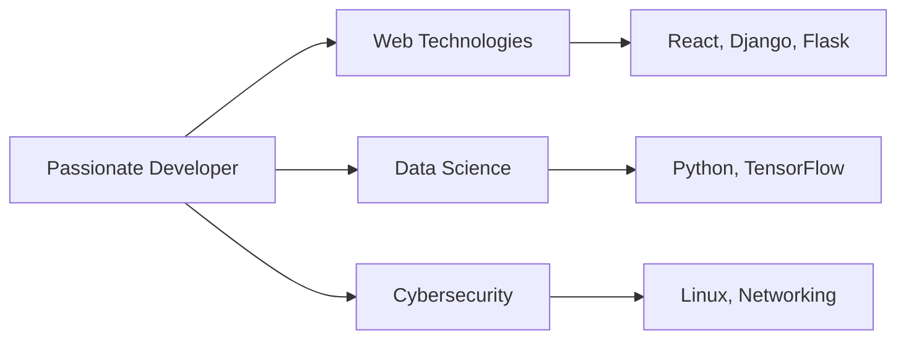

<h1 align="center">
  
</h1>

<h3 align="center" style="font-family: 'Segoe UI', sans-serif">Building digital solutions with passion and precision</h3>

  
  
  

---

### 🚀 About Me

- 🎓 **Computer Science & Mathematics** student at **Helwan University**
- 💻 Passionate about **web development**, **data science**, and **cybersecurity**
- 🚀 Constantly learning and building projects to expand my skills
- 🎤 Enjoy **teaching programming** and sharing knowledge
- 🌱 Currently diving deeper into **Backend** and **System Architecture**

---

### 🛠 Tech Stack

#### **Programming Languages**

  
  
  
  
  
  
  

#### **Frameworks & Libraries**

  
  
  
  
  

#### **Tools & Platforms**

  
  
  
  
  

---

### 📈 GitHub Analytics

  
  
  

  
  
  

---

### 🌟 Featured Projects

  
  
  
  
  
  
  
  
  

---

### 📫 Let's Connect

  
  
  
  
  

 

